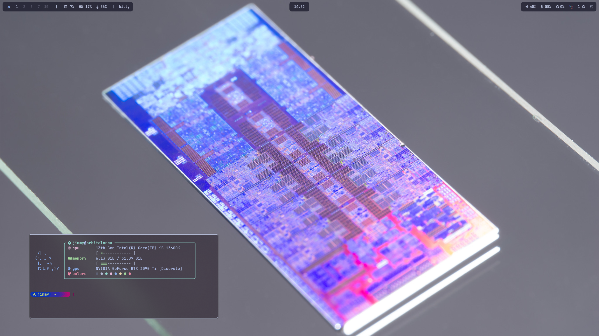

# My Dotfile repo
For syncing and sharing yet another arch + hyprland configuration



## Some reqs / configured apps and utilities
- bash
- neovim
- kitty
- starship
- hyprland
    - hypridle
    - hyprlauncher
    - hyprlock
    - hyprpicker
    - hyprshutdown
- waybar
- mako
- kvantum
- qt6ct
- slurp
- grim
- wl-clipboard
- libnotify
- hyprpolkitagent
- xdg-desktop-portal-hyprland
- dolphin
- wayscriber

# Install Instructions
1. setup up a base arch install, 
    - recommended to have `efivars` and `systemdboot`
    - `networkmanager`
    - make a user account
2. install `yay`
```bash
sudo pacman -S --needed git base-devel
git clone https://aur.archlinux.org/yay.git
cd yay
makepkg -si
```
3. install these packages with yay
> compositor and desktop
```
hyprland hypridle hyprlock hyprpaper wofi kitty fastfetch waybar starship 
```
> fonts
```
noto-fonts noto-fonts-cjk noto-fonts-emoji noto-fonts-extra ttf-jetbrains-mono-nerd
```
> text, code, and pdf
```
neovim fzf zaread zathura-pdf-poppler tree-sitter tree-sitter-grammars
```
> other tools
```
man stow brightnessctl gnome-keyring nm-connection-editor network-manager-applet pavucontrol pamixer blueman xdg-desktop-portal-hyprland zoxide
```
> customization
```
kvantum nwg-look 
```
> optional apps
```
qutebrowser nextcloud-client rnote discord thunderbird spotify spicetify-cli tailscale
```

3. download dotfiles
```bash
cd ~
mkdir .config # Important for not adding undesireable dotfiles 
git clone https://github.com/usymmij/dotfiles
cd dotfiles
git submodule update --init

# copy files to home
cp -r ./* ../ # OPTION 1: copy directly if updates won't be pushed
stow . # OPTION 2: symlink them if updating from this system
```

## Login
### Default
- by default, this config is configured start once logged in from `tty1` without a display manager

### Autologin
- to configure autologin on tty, find `getty@tty1.service` or `getty@tty1.service.d` in `/etc/systemd/system/` or one of its subdirectories, and add to the config the following

```
[Service]
ExecStart=
ExecStart=-/sbin/agetty --noreset --noclear --autologin username - ${TERM}
```

- Referenced from the [Arch wiki](https://wiki.archlinux.org/title/Getty#Virtual_console)

### Auto lock
- add `exec-once = hyprlock` to the hyprland config to launch to a locked screen

## Unsynced configs
> this section is only related for pushing the dotfiles if you used `stow`
> some of the configs (system specific) should not be pushed, but also need to 
> exist on the repo as a template
>
> local.lua for example will cause a crash on new systems if it doesn't exist after being cloned
> it needs to exist in the repo, but not on local copies so it can't be gitignored
> other unsynced configs can simply be gitignored

### files that should be in this list:
- `.config/hypr/local.lua`
- `.config/cyclebackground/current_background`

### current method

- go to the home directory copy of relevant file(s): make a backup elsewhere if they are changed
- delete the symlink (likely a parent directory) and create each *directory* that leads to the file
    - do this for each one
- go back to the `dotfiles` repository folder and run `stow`
    - if it fails because changed files exist and you dont want them updated, repeat the above
    - otherwise, add `--adopt` to copy the changes
- got back to the home directory: delete each symlink for the non-updated files, and replace with a hard copy (your backup)
- the `dotfiles/` copy will not be updated anymore

### old method: assume unchanged *not recommended*
> assume-unchanged tells git you haven't changed the file for performance, but shouldn't 
> be exploited in this way if you have changed it

```bash
# removing a file
git update-index --assume-unchanged file_name

# adding a file back
git update-index --no-assume-unchanged file_name 

# see what files are assumed unchanged
git ls-files -v | grep '^[[:lower:]]'
```

# Common Configurations and Issues

## Updating submodules
`git submodule update --recursive`

## Spicetify
- under `.config/spicetify/Themes`, make sure to install [spicetify-themes](https://github.com/spicetify/spicetify-themes)
- make sure that the themes are in the `Themes` folder, not the new one git created
- you can use the following commands
```bash
cd ~/.config/spicetify/Themes
git clone https://github.com/spicetify/spicetify-themes .
```

## ssh client alias
- to use the ssh orca alias, add `ORCA_SSH_IP=<ip address>` and `ORCA_SSH_PORT="<port number>"` to `/etc/environment`
- then, generate a new ssh key, and store it as `~/.ssh/orca` 
  - add `orca.pub` to `~/.ssh/authorized_keys` on the target server

# secure boot configuration
- [sbctl](https://github.com/Foxboron/sbctl)

## Theme
> I like the themes made by [Eliver Lara](https://github.com/EliverLara/)

- candy-icons
- Sweet KDE theme (Kvantum)
    - Sweet GTK theme

## Environment Variables
> /etc/environment

- `ORCA_SSH_IP=<ip address>`
- `ORCA_SSH_PORT=<port number>`

## pairing the same bluetooth device to both windows + linux when dual booting
[read this](https://unix.stackexchange.com/questions/255509/bluetooth-pairing-on-dual-boot-of-windows-linux-mint-ubuntu-stop-having-to-p)

## Steam Crashing
- As of 2025, the steam login webhelper crashes with some GTK theme configurations 
    - [see here](https://github.com/ValveSoftware/steam-for-linux/issues/11621)
    - this only happens to the login webhelper - the workaround was to change the widget, icon, and cursor themes 
    to Adwaita first, then login, then set them back to the custom theme. Autologin works fine.


## setting the theme with kvantum, qt6ct, and nwg-look

1. install both kvantum and qt6ct, then the theme and icons
    - [qt6ct-kde](https://aur.archlinux.org/packages/qt6ct-kde) sometimes fixes various issues
2. unzip the icons in `~/.icons` (or `/usr/share/.icons/` or `~/.local/share/.icons`)
    - theme can go anywhere, but I like to match icons
3. run kvantum, then install and apply the theme (it wont show until you set qt6ct as well)
4. use qt6ct to apply the `kvantum` theme, then the set the right icon theme as well

- this sets the theme for qt6 apps 
- to set the same theme for gtk apps, use nwg-look

1. set widget theme to Sweet-Gtk
2. set candy-icons in `Icon Theme`

### theme from AUR
- these themes can also be quickly installed as 
    - `sweet-kvantum-git`
    - `candy-icons-git`
    - the gtk theme from AUR is kinda broken and out of date, I would just install it from git

# Attributions

- SolDoesTech for [HyprV2](https://github.com/SolDoesTech/HyprV2)
- this [video](https://www.youtube.com/watch?v=y6XCebnB9gs&ab_channel=DreamsofAutonomy) about GNU stow by DreamsofAutnomy
- [kickstart.nvim](https://github.com/nvim-lua/kickstart.nvim) 
- Guardfetch for the [ascii art](https://github.com/GuardKenzie/pfetch-with-kitties) used in fetch
- [Fritzchens Fritz](https://www.flickr.com/photos/130561288@N04/) for die shots

